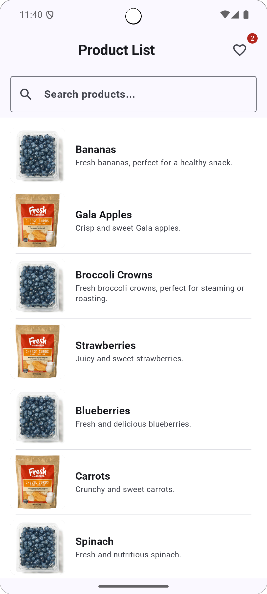

# [KnowMyApp] - MVI Product Listing App

A modern Android application demonstrating a product listing and detail view built with Jetpack Compose and following the MVI (Model-View-Intent) architectural pattern, complete with comprehensive unit testing.

## ✨ Features

Highlight the core functionalities your app offers. Be specific and enticing.

* **Product List Screen:**
    * Displays a scrollable list of products with their name, price, and image.
    * Loading state indicator for data fetching.
    * Error handling and display for network issues.
* **Product Details Screen:**
    * Presents detailed information about a selected product,
    *  including a larger image, full description, and additional attributes.
    * "Add to List" or "Share" functionality.
* **MVI Architecture:**
    * Clear separation of concerns using `Intent` for user actions, `State` for UI representation, and `Reducer` for state transitions.
    * Unidirectional data flow for predictable and debuggable state management.
    * Handles side effects efficiently [e.g., using `Flow`, or a dedicated effect handler].

## 🚀 Technologies Used

List the key technologies, libraries, and tools used in your project.

* **Kotlin:** Primary language for Android development.
* **Jetpack Compose:** Modern toolkit for building native Android UI.
* **MVI Architecture:** Implementation of the Model-View-Intent pattern for robust state management.
    * [Optional: Specify if you used a particular MVI library or pattern, e.g., "Custom MVI implementation leveraging Kotlin Flows," or "Using Orbit MVI," or "Mavericks," etc.]
* **Coroutines & Flow:** For asynchronous operations and reactive programming.
* **Unit Testing:** Comprehensive test suite for business logic and state management.
    * JUnit 4/5 for testing framework
    * MockK/Mockito for mocking dependencies
    * Turbine for testing Kotlin Flows
* **Dependency Injection:** Hilt for Dagger-based DI
* **Image Loading:** [Glide for efficient image loading and caching.]
* **Networking:** [Retrofit with OkHttp for API communication.]
* **Gradle Kotlin DSL:** For build configuration.

## 📸 Screenshots

This is where your screenshots shine! Embed them directly or link to them. Use clear, descriptive captions.

| Product List Screen                                     | Product Details Screen                                  |
| :------------------------------------------------------ | :------------------------------------------------------ |
| | |
| *[AppLandingScreen]* | *[ProductListScreen]* |
| | |
| *[productDetailScreen]* | *[InternetExceptionScreen]* |
| | |
| *[LocationPermission)]* | *[GettingLocation]* |
| | |
| *[AddToListScreen]* | *[TopAppBarWishList]* |
| | |
| *[WishListScreen]* | *[SharingContentToSocialApp]* |
| | |
| *[WishListRemovedItem]* | *[WishListScreen]* |

*Tip: For larger apps, you might use a dedicated `screenshots/` directory and link to them.*

## 📐 Architecture

A brief explanation of your MVI implementation. This is crucial for developers understanding your approach.

The application follows the MVI (Model-View-Intent) architectural pattern to ensure a predictable and scalable state management.

* **Model:** Represents the current state of the UI. It is an immutable data class that holds all the necessary data to render the UI.
* **View (Jetpack Compose Composables):** Observes the `State` from the `ViewModel` and renders the UI accordingly. It dispatches `Intent`s (user actions) to the `ViewModel`.
* **Intent:** Represents user actions or external events. These are sent from the View to the `ViewModel`.
* **ViewModel:** Acts as the `Processor` or `Reducer`. It receives `Intent`s, processes them (potentially interacting with data sources), updates the `State` based on the intent, and exposes the new `State` to the View.
* **Side Effects / Effects:** [Explain how you handle one-time events like navigation, showing a Toast, etc. For example: "One-time events like navigation or showing a Toast are handled as `Effect`s (or `SingleLiveEvent`/`Channel` based events) which are consumed by the View without changing the main UI state."]
